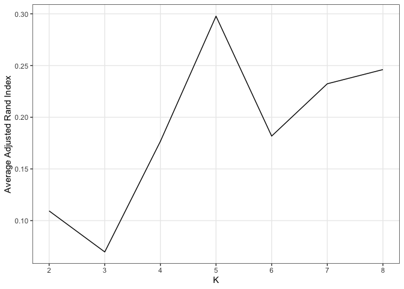
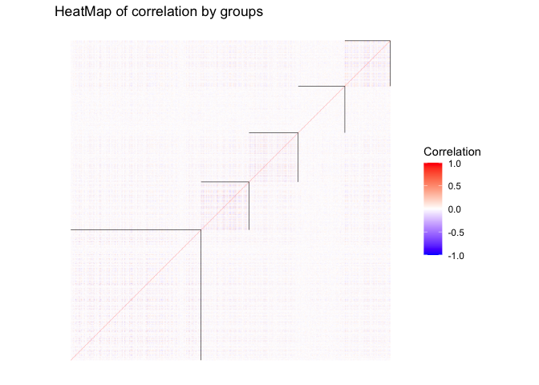

<!-- README.md is generated from README.Rmd. Please edit that file -->

# hbcm package

[](https://www.repostatus.org/#active)
[](https://github.com/rossellhayes/ipa/actions)

<!-- badges: start -->
<!-- badges: end -->

Community detection is a clustering method based on objects’ pairwise
relationships such that objects classified in the same group are more
densely connected than objects from different groups and correlations
within the same cluster are homogeneous. Most of the model-based
community detection methods such as the stochastic block model and its
variants are designed for networks with binary (yes/no) connectivity
values, which ignores the practical scenarios where the pairwise
relationships are continuous, reflecting different degrees of
connectivity. The heterogeneous block covariance model (HBCM) proposes a
novel clustering structure applicable on signed and continuous
connections, such as the covariances or correlations between objects.
Furthermore, it takes into account the heterogeneous property of each
object within a community. A novel variational EM algorithm is employed
to estimate the optimal group membership. HBCM has provable consistent
estimation of clustering memberships and its practical performance is
demonstrated by numerical simulations. The HBCM is illustrated on yeast
gene expression data and gene groups with correlated expression levels
responding to the same transcription factors are detected.

## Installation

To the date (2022-05-18) the package is still under development. You can
install the development version from [GitHub](https://github.com/) with:

``` r
# install.packages("devtools")
devtools::install_github("xiangli2pro/hbcm")

# load package
library('hbcm')
```

## Examples

### 1. Simulation data

Create a matrix data `x` of dimension `NxP=1000x500`, with columns
belonging to three (`K=5`) non-overlapping groups (groups labeled as 1
to 5). `x` values are determined by three things: parameter vector
`alpha` of size `NxK` (follows multivariate normal distribution),
heterogeneous parameters vector `hlambda` and `hsigma` of sizes `Px1`
respectively.

``` r
# check function arguments and return values documentation
?hbcm::data_gen
```

``` r
# x dimension
n <- 500
p <- 500

# cluster number
centers <- 5
# cluster labels follow a multinulli distribution with probability ppi
ppi <- rep(1/centers, centers)
# simulate a vector of labels from the multinulli distribution
labels <- sample(c(1:centers), size = p, replace = TRUE, prob = ppi) 

# specify the (mu, omega) of the MVN distribution of alpha
mu <- rep(0, centers)

off_diag <- 0.5
omega <- diag(rep(1, centers))
for (i in 1:centers) {
  for (j in 1:centers) {
    if (i!=j){
      omega[i,j] = off_diag
    } 
  }
}

# set up the generating function of hlambda and hsigma
hparam_func <- list(
  lambda_func = function(p) stats::rnorm(p, 0, 1),
  sigma_func = function(p) stats::rchisq(p, 2) + 1
)

# set up the number of simulation data
size <- 1

# generate data
data_list <- hbcm::data_gen(n, p, centers, mu, omega, labels, size, hparam_func)
x <- data_list$x_list[[1]]
```

### 2. Cluster the columns into `K` groups

Use heterogeneous block covariance model (HBCM) to cluster the columns
of data `x`. Need to provide a starting label guess and the number of
clusters.

``` r
# check function arguments and return values documentation
?hbcm::heterogbcm()
```

``` r
# use spectral clustering to make a label guess
start_labels <- kernlab::specc(abs(cor(x)), centers = centers)@.Data


# use hbcm to perform clustering
hbcm_res <- hbcm::heterogbcm(x, centers = centers, 
                tol = 1e-3, iter = 100, iter_init = 3, 
                labels = start_labels, 
                verbose = FALSE)
```

### 3. Evaluate the clustering performance

Use metric [Rand-Index](https://en.wikipedia.org/wiki/Rand_index) and
adjusted Rand-Index to compare the estimated label assignment with the
true label assignment. The higher the value, the better the performance.

``` r
# check function arguments and return values documentation
?hbcm::matchLabel()
```

``` r
# evaluate clustering performance
library('dplyr')
specc_eval <- hbcm::matchLabel(labels, start_labels) %>% 
  unlist() %>% round(3)
hbcm_eval <- hbcm::matchLabel(labels, hbcm_res$cluster) %>% 
  unlist() %>% round(3)

# result shows that hbcm model is better than spectral-clustering model in terms of rand index.
print(specc_eval)
#>    Rand adjRand 
#>   0.614   0.059
print(hbcm_eval)
#>    Rand adjRand 
#>   0.790   0.401
```

## Miscellaneous

### 1. Use cross-Validation to select `K` when it’s unknown

In practice the number of clusters is often unknown, in which case we
recommend to use the cross-validation with adjusted rand index as
standard to select the `K`. The optimal`K` is achieved at the highest
adjusted rand index.

``` r
lapply(c("parallel", "foreach", "doParallel", "tidyverse"), require, char=TRUE)
#> [[1]]
#> [1] TRUE
#> 
#> [[2]]
#> [1] TRUE
#> 
#> [[3]]
#> [1] TRUE
#> 
#> [[4]]
#> [1] TRUE

registerDoParallel(detectCores())
kVec <- c(2:8)
cv_res <- foreach(K = kVec,.errorhandling = 'pass',
               .packages = c("MASS","Matrix","matrixcalc","kernlab", "RSpectra")) %dopar%
  hbcm::crossValid_func_adjR(x, centers = K, pt = 10)

# summary & plot
data.frame(kVec, unlist(cv_res)) %>% 
  `colnames<-`(c("K", "adjR")) %>%
  ggplot() +
  geom_line(aes(x = K, y = adjR))+
  xlab("K")+
  ylab("Average Adjusted Rand Index")+
  theme_bw() +
  theme(panel.grid.minor = element_blank()) +
  scale_x_continuous(breaks =kVec) 
```



### 2. Use heatmap to display the group structure

``` r
hbcm::colMat_heatMap(
  affMatrix = cor(x), centers, labels = hbcm_res$cluster,
  margin = 0.5, midpoint = 0, limit = c(-1,1), size = 0.2,
  legendName = "Correlation", title = "HeatMap of correlation by groups")
```


